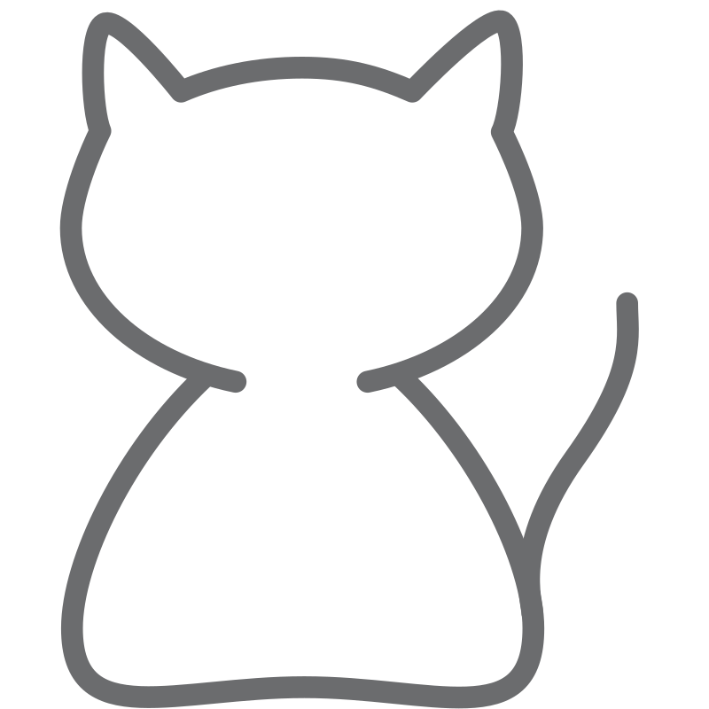

# CodeWhiskers 😺

CodeWhiskers is a VS Code extension that helps developers quickly understand unfamiliar code through intuitive explanations, visualizations, and contextual insights. The extension uses a cute, kitten-themed UI with "whiskers" that represent how the tool analyzes and explores code structure.

## Features

### 🐱 Whisker Parsing
Visualize code structure with animated whisker-like lines that connect related code elements. Whiskers extend and retract as you explore different sections of code.

### 😸 Curious Explanations
Get human-readable explanations of selected code blocks with varying levels of detail. A kitten icon indicates the complexity of the code.

### 🐈 Pounce Predictions
See function behavior predictions including inputs, outputs, and side effects when hovering over function references.

### 😻 Purr Prompts
Receive subtle reminders to document your code, with increasing visibility for important sections.

### 🐾 Paw Prints
Trace variable definitions, mutations, and usages with visual paw print paths through your code.

## Installation

1. Launch VS Code
2. Go to Extensions (Ctrl+Shift+X or Cmd+Shift+X)
3. Search for "CodeWhiskers"
4. Click Install
5. Reload VS Code

## Usage

### Explain Code
1. Select a block of code
2. Right-click and select "CodeWhiskers: Explain Selected Code" or use the command palette (Ctrl+Shift+P or Cmd+Shift+P)
3. View the explanation in the panel that appears

### Trace Variables
1. Select a variable
2. Right-click and select "CodeWhiskers: Trace Variable" or use the command palette
3. See all references to the variable highlighted with paw prints

### Analyze Functions
1. Open a file with functions
2. Use the command palette to select "CodeWhiskers: Analyze Function Behavior"
3. View the function behavior analysis in the panel that appears

### Get Documentation Suggestions
1. Open a file with undocumented code
2. Use the command palette to select "CodeWhiskers: Suggest Documentation"
3. See suggestions and click "Add Documentation" to automatically add templates

## Configuration

CodeWhiskers can be customized through VS Code settings:

- **Explanation Style**: Choose between conversational, detailed, or technical explanations
- **UI Theme**: Select different kitten themes (tabby, siamese, calico, black)
- **Animation Frequency**: Adjust the frequency of whisker animations (low, medium, high)

## Current Language Support

- JavaScript
- TypeScript

More languages coming soon!

## Contributing

Pull requests are welcome! See [CONTRIBUTING.md](CONTRIBUTING.md) for guidelines.

## License

This project is licensed under the MIT License - see the [LICENSE](LICENSE) file for details.

---

Made with ❤️ and 🐱 